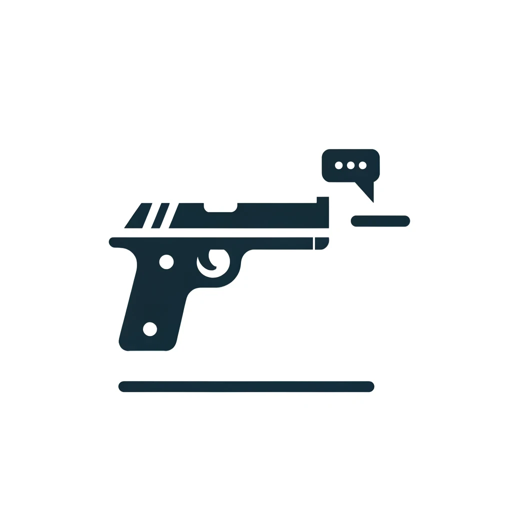

# ChatterGun - Decentralized Real-time Chat Component



## Introduction

**ChatterGun** is a cutting-edge web component that enables real-time, decentralized chat functionality in your web applications. Powered by GunDB, ChatterGun offers a robust, scalable solution for integrating chat systems that prioritize privacy and data sovereignty.

## Key Features

- **Offline first**: It doesnt matter if you have access to the internet. gun will save the chats locally(5mb) and sync up when you get back on the internet later. im even checking out if two peers can comunicate to each other without the network it the peers are connected.
- **Decentralized Architecture**: Leveraging GunDB, ChatterGun operates without the need for central servers, reducing risks related to data breaches and server downtime.
- **Real-Time Communication**: Messages are delivered instantly across the network, ensuring that users experience minimal delay.
- **Easy to Integrate**: Designed as a web component, it can be seamlessly included in any HTML page or modern JavaScript framework.
- **No Backend Required**: ChatterGun operates entirely client-side, with optional server-side integration for enhanced performance and reliability.
- **Fully Customizable**: Style and behavior can be tailored to fit the look and feel of your application.
- **Privacy-Focused**: With decentralized data storage, user messages are not stored on a central server, enhancing privacy.

## Installation

ChatterGun can be included directly from a CDN or installed via npm:

### CDN

Simply include the following `<script>` tag in your HTML to start using ChatterGun:

```html
<script src="https://cdn.jsdelivr.net/npm/chattergun@0.0.5/index.js"></script>
```

### or NPM (comming soon, not tested)

Install ChatterGun using npm or yarn:

```bash
npm install @valiantlynx/chattergun
# or
yarn add @valiantlynx/chattergun
```

After installation, you can import ChatterGun in your JavaScript project:

```javascript
import '@valiantlynx/chattergun';
```

## Usage

Once included in your project, you can add ChatterGun to your web page like any other HTML element:

```html
<chat-app></chat-app>
```

## Customization

You can customize ChatterGun using CSS variables for themes or directly manipulate the shadow DOM for more complex customizations.

### Example: Setting Theme Colors

```css
chat-app {
  --chat-background-color: #f0f0f0;
  --chat-text-color: #333;
  --chat-button-color: #007bff;
}
```

## Configuring( coming soon and many more)

To configure ChatterGun, set properties directly on the element:

```html
<chat-app peer-list="https://yourcustomrelay.com/gun"></chat-app>
```

## Building From Source (maybe ill build it)

If you prefer to build ChatterGun from the source, clone the repository and run:

```bash
npm install
npm run build
```

This will compile the source files into a distributable format in the `dist` folder.

## Contributing

Contributions are welcome! Please see our [GitHub repository](https://github.com/valiantlynx/chattergun) for submitting issues or pull requests.

## License

ChatterGun is open-sourced software licensed under the [MIT license](https://opensource.org/licenses/MIT).

---

For more details and documentation, please visit our [official website](https://chattergun.valiantlynx.com) or the [GitHub repository](https://github.com/valiantlynx/chattergun).
